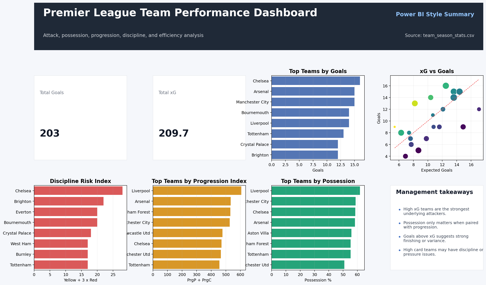

# Premier-League-Team-Performance-Analytics-Dashboard
pl25-26 \ power bi edition 

An executive-level data analytics dashboard evaluating tactical metrics, attacking efficiency, and disciplinary risk across all 20 clubs for the current English Premier League campaign. This project replicates a professional Power BI reporting structure to deliver actionable sports intelligence from raw team data.

# Interactive Dashboard Preview

---

# Visual Components & Metrics

This professional, data-driven layout is split into three high-impact reporting zones to evaluate team success and tactical profiles:

### 1. Executive Summary KPIs
**Total Goals:** 203 cumulative goals scored across the league to establish the baseline production level[cite: 1].
**Total Expected Goals (xG):** 209.7 xG, highlighting structural chance creation and minor underperformance in finishing variance across the board[cite: 1].
**Average Possession:** 50.0% benchmark to track ball control baselines against club outcomes[cite: 1].

### 2. Core Visualizations
**Top Teams by Goals (Horizontal Bar Chart):** Ranks the league's most lethal attacking units, showcasing Chelsea (16 goals), Arsenal (15 goals), and Manchester City (15 goals) leading the table[cite: 1].
* **xG vs. Goals Scatter Plot (Attacking Efficiency Matrix):** Maps clinical efficiency. Teams above the equilibrium line (like Bournemouth) are overperforming their expected output, while teams far below are failing to convert high-quality chances.
**Top Teams by Possession (Vertical Bar Chart):** Tracks the dominant possession-based systems, led by Liverpool, Manchester City, and Chelsea[cite: 1].
* **Top Teams by Progression Index (PrgP + PrgC):** Combines Progressive Passes and Progressive Carries to identify the most vertically aggressive, forward-moving teams in transition.
* **Discipline Risk Index ($Yellow + 3 \times Red$):** A custom engineered safety risk metric weighting severe infractions. [cite_start]It highlights defensive volatility, with Chelsea leading at a risk index score of 28[cite: 1].

### 3. Management Takeaways & Insights Panel
* **Attacking Strength:** High xG teams represent the strongest underlying attacking systems, regardless of short-term luck.
* **Possession Strategy:** Possession metrics only translate into points when successfully paired with high forward ball progression.
* **Finishing Variance:** Goals scored consistently above the xG threshold point to elite individual finishing talent or positive statistical variance.
* **Squad Stability:** High-card teams point to tactical discipline or defensive pressure vulnerabilities under sustained attack.

---

## 🛠️ Tech Stack & Methods
* [cite_start]**Data Source:** `team_season_stats.csv` (Comprehensive multi-column league data tracking 35 performance metrics)[cite: 1].
* **Architecture:** Structured with Power BI wireframing logic (KPI cards, side-by-side comparative matrices, dynamic filters representation, and a dedicated executive summary panel).
* **Skills Demonstrated:** Data engineering, multi-indexed CSV parsing, feature engineering (Discipline Risk Index formulation), and executive dashboard UI design.
